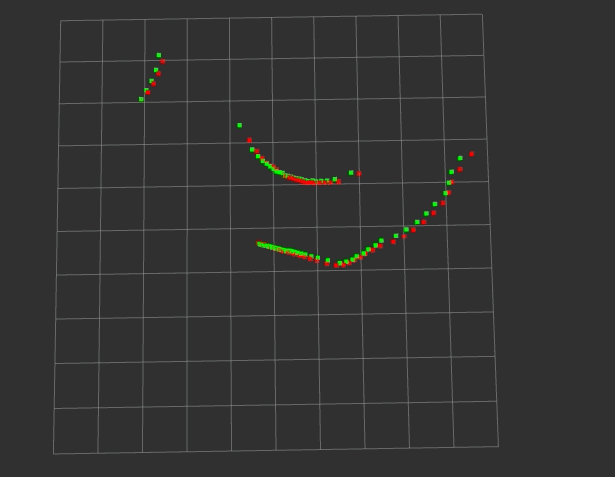

# laser_deskew
ros package for 2d laser deskew using tf.

## IO

- input  
/scan(sensor_msgs/LaserScan)  
/tf(odom link and laser lnk)

- output  
/deskewed_scan(sensor_msgs/LaserScan)

## param
- laser_frame_id(defalut:"laser_link")

## demo

data:[ros.org Introduction to Working With Laser Scanner Data](http://wiki.ros.org/laser_pipeline/Tutorials/IntroductionToWorkingWithLaserScannerData)

```
rviz -d src/laser_deskew/rviz/deskew.rviz 
```

```
roslaunch laser_deskew laser_deskew.launch
```

```
rosbag play Mapping1.bag --clock
```



Green: deskewed scan, Red: input scan

